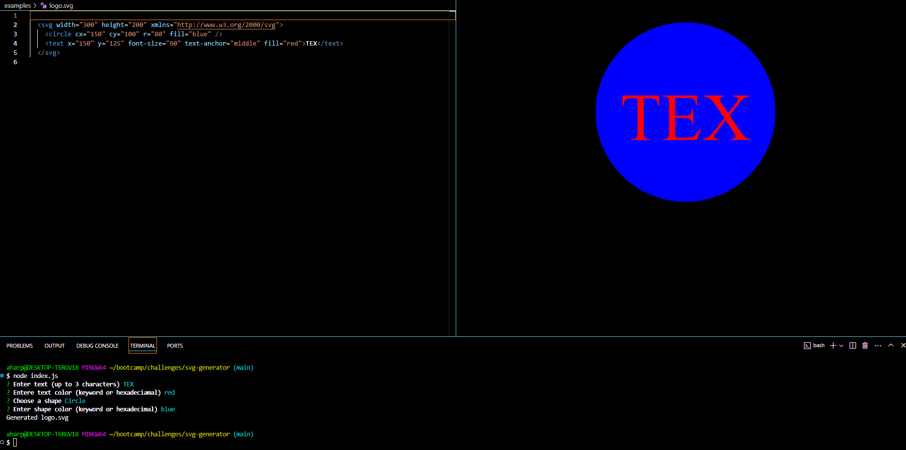

# SVG-GENERATOR

## Intro
The Svg-Generator is a simple command-line application that creates a SVG logo based on user input.

## Usage
- Install modules \
` 
npm i
`
- (Optional) Run tests `npm test`
 - Run application \
 ` 
 node index.js
 `
 - Enter data asked by the prompts
 - Open generated SVG `logo.svg` in the `examples` folder
 
 ## Live URLs
 [Github Repo](https://github.com/aharper2568/svg-generator)\
 [Video Tutorial](https://drive.google.com/file/d/1F6E7DM2pAylM8dRiIlvd4asVbGu-o7ke/view?usp=sharing)

 ## Screenshots

 

## Author

Developed in VSCode by **Anthony Harper**
 